# 🔄 GitHub 自动部署到 Vercel - 完整配置指南

## 🎯 目标

实现：**GitHub 推送代码 → Vercel 自动部署**

每次执行 `git push origin main`，Vercel 自动检测并部署最新版本。

---

## ✅ 第1步：连接 GitHub 到 Vercel

### 方法 A：从 Vercel 导入仓库（推荐）

1. **访问 Vercel 导入页面**
   ```
   https://vercel.com/new
   ```

2. **连接 GitHub 账号**
   - 点击 **Continue with GitHub**
   - 授权 Vercel 访问您的 GitHub 账号
   - 如果已经连接，跳过此步

3. **导入仓库**
   - 在 **Import Git Repository** 页面
   - 找到您的仓库：`JingHuiSong/-`
   - 点击 **Import**

4. **配置项目**
   ```
   Project Name: 您的项目名称（如：yuanjianzhe-system）
   Framework Preset: Next.js
   Root Directory: ./
   Build Command: pnpm prisma generate && pnpm build
   Install Command: pnpm install
   Output Directory: .next
   ```

5. **配置环境变量**
   
   **必需配置（4个）：**
   
   | 变量名 | 值 | 说明 |
   |--------|-----|------|
   | `DATABASE_URL` | `${POSTGRES_PRISMA_URL}` | 数据库连接 |
   | `NEXTAUTH_URL` | `https://your-app.vercel.app` | 应用地址 |
   | `NEXTAUTH_SECRET` | 运行 `openssl rand -base64 32` | 认证密钥 |
   | `NODE_ENV` | `production` | 环境类型 |

6. **点击 Deploy**
   - ✅ 首次部署开始
   - ⏳ 等待 2-3 分钟

---

## ✅ 第2步：验证自动部署已启用

### 检查 GitHub 集成状态

1. **访问 Vercel 项目设置**
   ```
   Vercel Dashboard → 您的项目 → Settings → Git
   ```

2. **确认连接信息**
   
   应该显示：
   ```
   ✅ Connected Git Repository
   Repository: JingHuiSong/-
   Branch: main
   ```

3. **检查自动部署设置**
   
   确保以下选项已启用：
   - ✅ **Production Branch**: `main`
   - ✅ **Automatic Deployments**: Enabled
   - ✅ **Deploy Hooks**: （可选）

### 检查 GitHub Webhook

1. **访问 GitHub 仓库设置**
   ```
   https://github.com/JingHuiSong/-/settings/hooks
   ```

2. **确认 Vercel Webhook 存在**
   
   应该看到：
   ```
   ✅ https://api.vercel.com/v1/integrations/deploy/...
   Recent Deliveries: ✓ (绿色对勾)
   ```

---

## ✅ 第3步：配置自动部署规则

### 配置生产分支

1. **访问 Git 设置**
   ```
   Vercel Dashboard → Settings → Git
   ```

2. **设置生产分支**
   ```
   Production Branch: main
   ```

3. **启用自动部署**
   ```
   ✅ Automatically deploy all pushes to Production Branch
   ```

### 配置预览部署（可选）

**为其他分支创建预览环境：**

```
✅ Automatically create Preview Deployments for:
   - Pull Requests
   - All branches
```

**好处：**
- 每个 PR 自动生成预览 URL
- 测试功能不影响生产环境
- 团队协作更方便

---

## 🧪 第4步：测试自动部署

### 测试流程

1. **修改代码**
   
   例如修改首页标题：
   ```typescript
   // app/page.tsx
   export default function Home() {
     return <div>测试自动部署！</div>
   }
   ```

2. **提交并推送**
   ```bash
   git add .
   git commit -m "测试自动部署"
   git push origin main
   ```

3. **观察 Vercel 自动部署**
   
   - 访问 Vercel Dashboard
   - 进入 **Deployments** 标签
   - 应该看到新的部署开始：
     ```
     🔄 Building...
     ⏳ main@[commit-hash] - "测试自动部署"
     ```

4. **等待部署完成**
   
   通常 2-3 分钟：
   ```
   ✅ Ready
   🌐 https://your-app.vercel.app
   ```

5. **验证更新**
   
   访问您的应用，确认更改已生效。

---

## 📊 自动部署工作流程

```mermaid
graph LR
    A[本地修改代码] --> B[git commit]
    B --> C[git push origin main]
    C --> D[GitHub 接收推送]
    D --> E[GitHub Webhook 通知 Vercel]
    E --> F[Vercel 拉取最新代码]
    F --> G[Vercel 开始构建]
    G --> H[运行 build 命令]
    H --> I[部署到生产环境]
    I --> J[✅ 部署成功]
```



**时间线：**
- 推送代码：10 秒
- Webhook 触发：< 5 秒
- 构建时间：2-3 分钟
- **总计：约 3-4 分钟**

---

## 🔧 配置部署通知

### 方法 A：Vercel 集成通知

1. **访问集成页面**
   ```
   Vercel Dashboard → Settings → Integrations
   ```

2. **添加通知渠道**
   
   支持：
   - Slack
   - Discord  
   - Email
   - Webhooks

3. **配置 Slack（示例）**
   ```
   - 点击 Slack Integration
   - 连接 Slack 工作区
   - 选择通知频道
   - 配置通知事件：
     ✅ Deployment Started
     ✅ Deployment Ready
     ✅ Deployment Failed
   ```

### 方法 B：GitHub Actions 通知（可选）

创建 `.github/workflows/deploy-notification.yml`：

```yaml
name: Deployment Notification

on:
  push:
    branches: [ main ]

jobs:
  notify:
    runs-on: ubuntu-latest
    steps:
      - name: 发送部署通知
        run: |
          echo "🚀 代码已推送到 main 分支"
          echo "⏳ Vercel 正在自动部署..."
```

---

## 🎨 配置部署预览

### 启用 PR 预览部署

1. **访问 Git 设置**
   ```
   Vercel Dashboard → Settings → Git
   ```

2. **启用预览部署**
   ```
   ✅ Automatically create Preview Deployments for Pull Requests
   ```

3. **工作流程**
   ```
   1. 创建新分支：git checkout -b feature/new-feature
   2. 推送分支：git push origin feature/new-feature
   3. 创建 PR：GitHub → Pull Requests → New PR
   4. Vercel 自动创建预览：
      🌐 https://your-app-git-feature-new-feature.vercel.app
   5. 在 PR 中测试功能
   6. 合并到 main → 自动部署到生产环境
   ```

---

## 🔒 配置部署保护

### 启用部署保护规则

1. **访问部署保护**
   ```
   Vercel Dashboard → Settings → Deployment Protection
   ```

2. **配置保护选项**
   ```
   ✅ Require approval before Production Deployment
   ✅ Lock Deployments (防止意外部署)
   ✅ Password Protection (为预览添加密码)
   ```

3. **配置允许的部署者**
   ```
   Team → Members → 设置角色权限
   ```

---

## 📝 配置 .gitignore

确保不提交敏感文件：

```bash
# .gitignore

# dependencies
/node_modules
/.pnp
.pnp.js

# testing
/coverage

# next.js
/.next/
/out/

# production
/build

# misc
.DS_Store
*.pem

# debug
npm-debug.log*
yarn-debug.log*
yarn-error.log*

# local env files
.env
.env*.local
.env.production

# vercel
.vercel

# typescript
*.tsbuildinfo
next-env.d.ts

# prisma
prisma/*.db
prisma/*.db-journal

# 企业数据（可选）
data/settings.json
```

---

## 🚀 常用部署命令

### 本地开发到生产的完整流程

```bash
# 1. 本地开发
pnpm dev

# 2. 测试构建
pnpm build
pnpm start

# 3. 提交代码
git add .
git commit -m "功能描述"

# 4. 推送到 GitHub（触发自动部署）
git push origin main

# 5. 查看部署状态（可选）
vercel ls

# 6. 查看实时日志（可选）
vercel logs --follow
```

### 快速回滚

如果新版本有问题，快速回滚到上一个版本：

```bash
# 方法 A：通过 Vercel Dashboard
1. Deployments → 选择上一个成功的部署
2. 点击 ... → Promote to Production

# 方法 B：通过 CLI
vercel rollback
```

---

## 🔍 监控部署状态

### 实时监控

1. **Vercel Dashboard**
   ```
   Dashboard → Deployments
   实时显示所有部署状态
   ```

2. **部署日志**
   ```
   点击部署 → View Function Logs
   查看运行时错误
   ```

3. **性能监控**
   ```
   Analytics 标签
   - 页面加载时间
   - 访问量
   - 地理分布
   ```

### 设置监控告警

```bash
# 使用 Vercel CLI 查看状态
vercel --version
vercel ls
vercel inspect [deployment-url]
```

---

## 🐛 故障排除

### 问题 1: 推送后没有自动部署

**检查清单：**
- [ ] GitHub Webhook 是否存在？
- [ ] Vercel 项目是否连接到正确的仓库？
- [ ] 分支名是否正确（main 或 master）？
- [ ] GitHub 和 Vercel 账号是否已连接？

**解决：**
```bash
# 1. 检查 Webhook
访问：https://github.com/JingHuiSong/-/settings/hooks
确认 Vercel webhook 存在且状态为 ✓

# 2. 重新连接仓库
Vercel Dashboard → Settings → Git
点击 Disconnect → 重新连接

# 3. 手动触发部署
vercel --prod
```

### 问题 2: 部署失败

**常见原因：**
- 构建错误
- 环境变量缺失
- 依赖安装失败

**查看日志：**
```bash
# 方法 A: Dashboard
Deployments → 失败的部署 → View Build Logs

# 方法 B: CLI
vercel logs [deployment-url]
```

### 问题 3: 环境变量未更新

**解决：**
```bash
# 更新环境变量后，需要重新部署
Vercel Dashboard → Deployments → Redeploy
```

---

## ✅ 自动部署检查清单

完成配置后检查：

- [ ] GitHub 仓库已连接到 Vercel
- [ ] Webhook 已创建且工作正常
- [ ] 生产分支设置为 `main`
- [ ] 自动部署已启用
- [ ] 环境变量已配置
- [ ] 测试推送成功触发部署
- [ ] 部署通知已配置（可选）
- [ ] PR 预览已启用（可选）
- [ ] 部署保护已配置（可选）

---

## 📊 推荐的工作流程

### 单人开发

```bash
# 直接在 main 分支开发
git checkout main
# 修改代码
git add .
git commit -m "描述"
git push origin main
# ✅ Vercel 自动部署
```

### 团队协作

```bash
# 1. 创建功能分支
git checkout -b feature/new-feature

# 2. 开发功能
# ...修改代码

# 3. 提交到分支
git add .
git commit -m "添加新功能"
git push origin feature/new-feature

# 4. 创建 Pull Request
# GitHub 上创建 PR
# ✅ Vercel 自动创建预览部署

# 5. 代码审查通过后合并
# Merge PR → main
# ✅ Vercel 自动部署到生产环境
```

---

## 🎯 最佳实践

### 1. 使用语义化提交信息

```bash
# 好的提交信息
git commit -m "feat: 添加订单导出功能"
git commit -m "fix: 修复登录页面样式问题"
git commit -m "docs: 更新部署文档"

# 不好的提交信息
git commit -m "update"
git commit -m "修复bug"
```

### 2. 定期检查部署日志

每次部署后检查：
- 构建时间（是否异常长）
- 错误日志（是否有警告）
- 性能指标（是否下降）

### 3. 保持依赖更新

```bash
# 定期更新依赖
pnpm update

# 检查过时的包
pnpm outdated

# 更新后测试并部署
pnpm build
git commit -am "chore: 更新依赖"
git push origin main
```

---

## 🎉 完成！

现在您的工作流程是：

1. **本地修改代码** → 2. **git push** → 3. **Vercel 自动部署** → 4. **✅ 上线！**

**每次推送只需要：**
```bash
git add .
git commit -m "更新描述"
git push origin main
```

**Vercel 会自动：**
- ✅ 检测代码变更
- ✅ 拉取最新代码
- ✅ 运行构建
- ✅ 部署到生产环境
- ✅ 发送通知（如果配置了）

**预见世界，预见自己** 🌍✨

---

## 📞 需要帮助？

如有问题：
- 📖 查看 [Vercel 文档](https://vercel.com/docs)
- 💬 GitHub Issues
- 📧 Email: admin@yuanjianzhe.com

